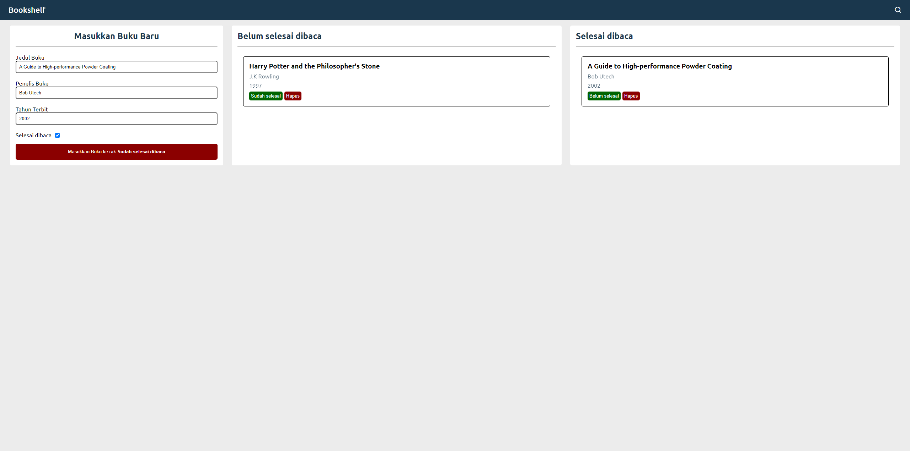

# Landing Page
Submission: Aplikasi Pengelolaan Data Menggunakan DOM dan Web Storage pada kelas Belajar Membuat Front-End Web untuk Pemula

#### Kriteria 1: Mampu Menambahkan Data Buku
- Bookshelf Apps harus mampu menambahkan data buku baru.
- Data buku yang disimpan merupakan objek JavaScript dengan struktur berikut:
    ```
    {
        id: string | number,
        title: string,
        author: string,
        year: number,
        isComplete: boolean,
    }
    ```
    Berikut contoh data riilnya:
    ```
    {
        id: 3657848524,
        title: 'Harry Potter and the Philosopher\'s Stone',
        author: 'J.K Rowling',
        year: 1997,
        isComplete: false,
    }
    ```
> Catatan:
Untuk id buku pada tiap buku yang disimpan haruslah unik. Tips dalam menetapkan nilai untuk adalah Anda bisa memanfaatkan nilai timestamp. Untuk mendapatkan nilai timestamp di JavaScript cukup mudah, cukup dengan menuliskan expressions +new Date().

#### Kriteria 2: Memiliki Dua Rak Buku
- Bookshelf Apps harus memiliki 2 Rak buku. Yakni, “Belum selesai dibaca” dan “Selesai dibaca”.
- Rak buku "Belum selesai dibaca" hanya menyimpan buku jika properti `isComplete` bernilai false.
- Rak buku "Selesai dibaca" hanya menyimpan buku jika properti `isComplete` bernilai true.

#### Kriteria 3: Dapat Memindahkan Buku antar Rak
- Buku yang ditampilkan pada rak, baik itu "Belum selesai dibaca" maupun "Selesai dibaca" harus dapat dipindahkan di antara keduanya.

#### Kriteria 4: Dapat Menghapus Data Buku
- Buku yang ditampilkan pada rak, baik itu "Belum selesai dibaca" maupun "Selesai dibaca" harus dapat dihapus.

#### Kriteria 5: Manfaatkan localStorage dalam Menyimpan Data Buku
- Data buku yang ditampilkan pada rak, baik itu "Belum selesai dibaca" maupun "Selesai dibaca" harus dapat bertahan walaupun halaman web ditutup.
- Dengan begitu, Anda harus menyimpan data buku pada localStorage.

#### Saran
- Tambahkan fitur pencarian untuk mem-filter buku yang ditampilkan pada rak sesuai dengan title buku yang dituliskan pada kolom pencarian.
- Berkreasilah dengan membuat proyek Bookshelf Apps tanpa menggunakan project starter.
- Menuliskan kode dengan bersih.
    - Bersihkan comment dan kode yang tidak digunakan.
    - Indentasi yang sesuai.
- Terdapat improvisasi fitur seperti (pilih satu): 
    - Custom Dialog ketika menghapus buku.
    - Dapat edit buku.
    - dsb.

## Rating Submission
⭐⭐⭐⭐

## Screenshot


## Tech Stack
[](https://github.com/takasicode/bookshelf)
 